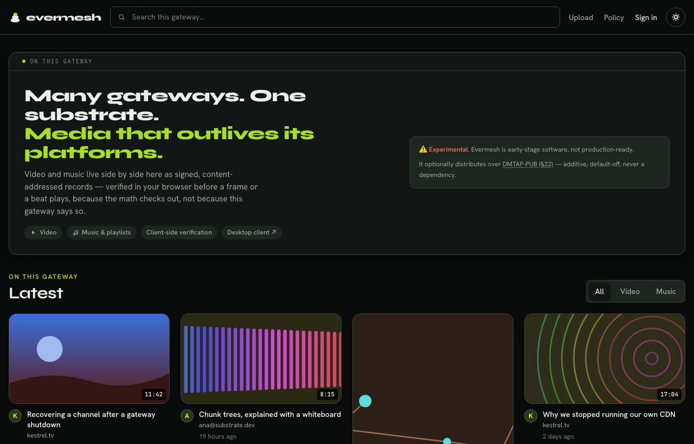
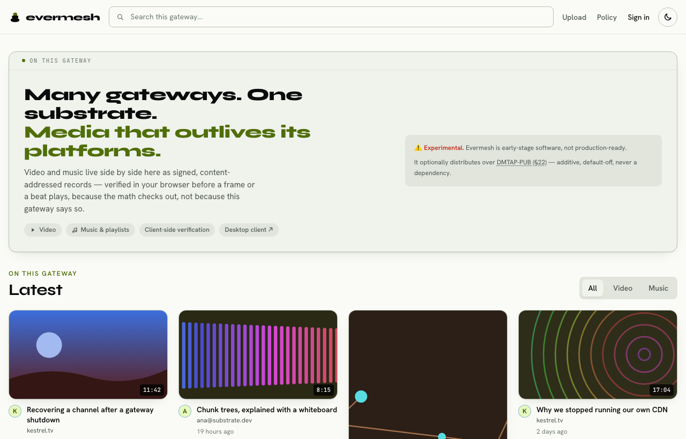
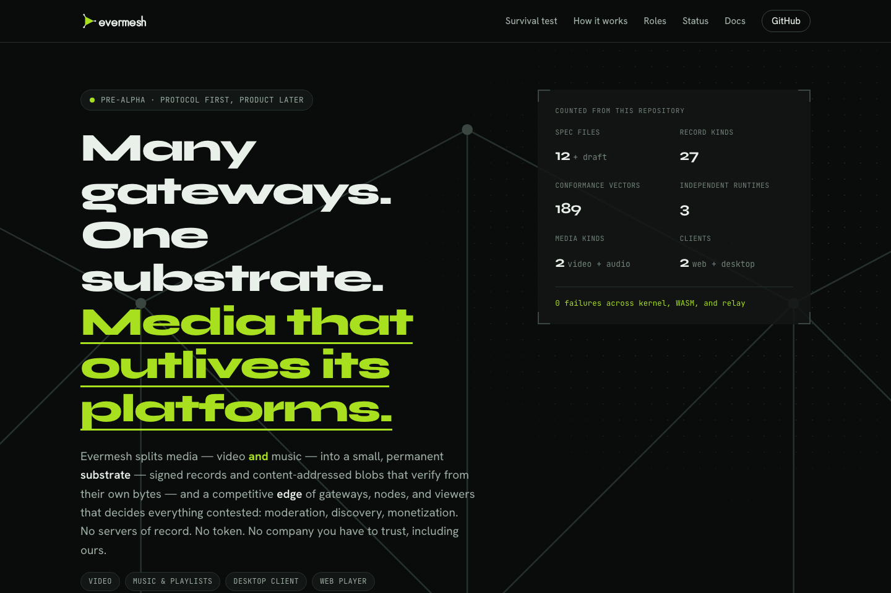
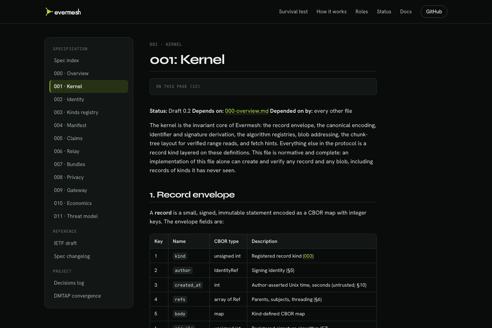

<p align="center">
  <picture>
    <source media="(prefers-color-scheme: dark)" srcset="assets/logo-dark.svg">
    
  </picture>
</p>

<p align="center">
  <b>Many gateways. One substrate. Media that outlives its platforms.</b>
</p>

<p align="center">
  
  
  
  
  
  
</p>

> ⚠️ **Experimental.** Evermesh is early-stage software and not
> production-ready — see [Status by component](#status-by-component) below.
> It has its own native substrate (signed records, identity, blobs,
> bundles) and does not require DMTAP for anything; it can *optionally*
> distribute over [DMTAP-PUB (§22)](docs/DMTAP-CONVERGENCE.md) as an
> additive, default-off encode/decode path (`--features dmtap-pub`) for
> interop with the wider DMTAP substrate. Formerly named **Boloka**, and
> before that **Vidmesh**.

Evermesh is a decentralized media protocol built on a substrate of
self-certifying data: signed records (CBOR, Ed25519, BLAKE3) and
content-addressed blobs. No servers of record, no token, no mandatory
dependencies. Independent **gateways** index and serve their own selection of
the substrate; **nodes** pin and seed chosen content; **viewers** verify
everything client-side while they watch.

**Status: pre-alpha.** The protocol kernel, the relay, the WASM/TS bindings,
the gateway backend and web frontend, and the cross-implementation
conformance suite are implemented and — as of this writing — their test
suites **run and pass** (see [Status by component](#status-by-component)).
This is not shipped software: there is no deployment, no swarm/P2P transport,
no live-streaming product surface, and the desktop node is a scaffold. The
[spec](spec/) is normative; where code and spec disagree, the spec wins.

## Status by component

| Path | What it is | State |
|---|---|---|
| `spec/` | Normative protocol spec (000–011 + IETF draft), CC-BY-SA-4.0 | **Complete** for v1 scope |
| `crates/evermesh-kernel` | Records, identity/rotation, blobs+chunk proofs, bundles, canonical codec, all 27 record kinds | **Implemented, tested** (193 unit + 7 property tests) |
| `crates/evermesh-relay` | Axum `/sync` websocket relay: envelope validation, storage, filtered subscriptions, gossip, PoW, rate-limit, retention, blob sidecar (PUT/GET-range/proof) | **Implemented, tested** (47 tests) |
| `crates/evermesh-wasm` | wasm-bindgen bindings over the kernel | **Implemented**, builds to WASM, tested |
| `packages/kernel-ts` | Typed TS API over the WASM kernel | **Implemented, tested** (5 tests) |
| `packages/ui` | Shared React components (player, verification badge) | **Implemented**, typechecks |
| `apps/gateway/server` | Gateway backend: config, SQLite index, policy engine, key custody, relay clients, kind-aware ingest, upload/original-only pipeline, JSON API | **Implemented, tested** (45 tests); boots and connects to a relay |
| `apps/gateway/web` | Gateway frontend: React + Vite + Tailwind | **Implemented, tested** (45 tests); builds |
| `apps/site` | evermesh.org: static landing page + docs viewer | **Built**, browser-checked (`just site-check`) |
| `tools/conformance` | 189 deterministic vectors + a runner replaying them against three runtimes | **Implemented, green** (see below) |
| `crates/evermesh-node` | Desktop node app (Tauri 2) | **Scaffold only** |

### Spec'd but not built

- **Swarm / P2P retrieval, WebRTC, BitTorrent-style transport** — described in
  the spec and threat model; **no implementation**. Blob retrieval today is
  the relay's HTTP sidecar only.
- **Live streaming** — the `live.manifest` / `live.chat` record **kinds** exist
  and validate in the kernel, but there is **no live ingest, no player, and no
  product surface**.
- **Non-custodial key flows** — the reference gateway custodies keys
  server-side (spec 002 §7 / 009 §5); client-held keys are a later phase.
- **Desktop node** — `crates/evermesh-node` is a Tauri scaffold; it pins and
  seeds nothing yet.

## Conformance: the golden rule

The suite replays the same vectors against three independent runtimes — the
`evermesh-kernel` crate in-process, `@evermesh/kernel` under Node/WASM, and a
live `evermesh-relay` over its `/sync` websocket. **A vector must pass
identically in every runtime**; a divergence is a protocol/binding bug, never
a fixture to special-case. Current result (0 failures across all three; the
differing counts are documented per-runtime skips — each runtime only checks
what it is responsible for):

| Target | Pass | Fail | Skip |
|---|---:|---:|---:|
| kernel | 189 | 0 | 0 |
| node (WASM/kernel-ts) | 142 | 0 | 47 |
| relay (`/sync`) | 115 | 0 | 74 |

## What it looks like

The **uniform reference UI** (spec [009 §7](spec/009-gateway.md)) is the one
interface every gateway ships. An operator may re-skin its accents by
overriding the `--bo-*` tokens in
[`apps/gateway/web/src/styles/index.css`](apps/gateway/web/src/styles/index.css)
— and nothing else. The brand those tokens carry (palette, type, the
measured contrast table) is documented in [`assets/README.md`](assets/README.md).

| Reference UI — dark | Reference UI — light |
|---|---|
|  |  |

> These two are the real frontend served against a **stubbed** gateway API
> (`node tools/brand/ui-shots.mjs`), because no evermesh gateway is deployed
> — see the status table above. They show the interface, not a running
> network.

| evermesh.org | Docs viewer |
|---|---|
|  |  |

The site in [`apps/site`](apps/site/) is static and self-contained;
`just site-check` drives a real browser over it (console errors, links,
every docs route, both themes) and `just site-shots` refreshes these
images.

## Development

Prerequisites: Rust stable, Node ≥ 22 (24 recommended), pnpm,
[`just`](https://github.com/casey/just). `ffmpeg`/`ffprobe` are **optional** —
without them the gateway runs an original-only upload path (no renditions/HLS).

```sh
just setup          # pnpm install
just wasm           # build the WASM kernel into packages/kernel-ts/wasm
just test           # cargo test --workspace + pnpm -r test
```

Per-suite, if you want to run them individually:

```sh
cargo test --workspace                          # kernel, relay, wasm, node, conformance
pnpm --filter @evermesh/kernel build && \
  pnpm --filter @evermesh/kernel test            # TS kernel (needs `just wasm` first)
pnpm --filter @evermesh/gateway-server test      # gateway backend (45)
pnpm --filter @evermesh/gateway-web test         # gateway frontend (45)
```

### Conformance suite

```sh
cargo run --bin generate                        # (re)generate vectors — deterministic
cargo run --bin evermesh-conformance -- run --target kernel
cargo run --bin evermesh-conformance -- run --target node    # needs `just wasm` + kernel-ts build
# relay target needs a live relay (see the smoke run below), then:
cargo run --bin evermesh-conformance -- run --target relay --relay-url ws://127.0.0.1:8787/sync
```

### Smoke run (relay + gateway, no ffmpeg)

Bring up a relay with the blob sidecar enabled and exercise blob
put / ranged-get / chunk-proof, then boot the gateway against it.

```sh
# 1. Build the workspace
cargo build --workspace

# 2. A relay config with the blob sidecar on (writes to ./smoke)
mkdir -p smoke/blobs
cat > smoke/relay.json <<'JSON'
{
  "listen_addr": "127.0.0.1:8787",
  "db_path": "smoke/relay.sqlite3",
  "name": "smoke-relay.local",
  "pow_min_bits": 0,
  "blob": { "enabled": true, "dir": "smoke/blobs", "max_bytes": 4294967296 }
}
JSON
./target/debug/evermesh-relay smoke/relay.json &

# 3. Put a blob; the server derives (never trusts) its content address
printf 'hello evermesh smoke test blob payload' > smoke/payload.bin
ID=$(curl -s -X PUT --data-binary @smoke/payload.bin \
       http://127.0.0.1:8787/blob | sed -E 's/.*"id":"([^"]+)".*/\1/')

# 4. Fetch it back whole, then a byte range (expect 206 Partial Content)
curl -s "http://127.0.0.1:8787/blob/$ID" | diff - smoke/payload.bin && echo "round-trip OK"
curl -s -i -H "Range: bytes=6-13" "http://127.0.0.1:8787/blob/$ID" | head -5

# 5. Fetch a chunk-tree range proof (CBOR)
curl -s -i "http://127.0.0.1:8787/blob/$ID/proof?chunk=0" | head -3

# 6. Boot the gateway against the relay (config omits ffmpeg = original-only)
cp apps/gateway/server/config.example.json smoke/gateway.json   # then edit paths/secrets,
                                                                # set relays to ws://127.0.0.1:8787/sync
GATEWAY_CONFIG=smoke/gateway.json \
  pnpm --filter @evermesh/gateway-server exec node --experimental-transform-types src/main.ts
# GET http://127.0.0.1:8080/api/info  ->  200 {"gateway":...,"relays":[...],"uploadEnabled":true}
```

`just spec-pdf` renders the protocol spec (requires pandoc + tectonic).

### Site and brand

```sh
just site-serve     # preview apps/site at http://127.0.0.1:8080
just site-check     # docs-copy sync check + real-browser check of the site
just site-shots     # refresh apps/site/screenshots/
just brand          # re-render the OG card and apple-touch-icon
```

## License

Code: MIT OR Apache-2.0 (`LICENSE-MIT`, `LICENSE-APACHE`).
Spec: CC-BY-SA-4.0 (`LICENSE-SPEC`).

---

<p align="center">
  <a href="https://vulos.org"></a><br>
  <sub><a href="https://vulos.org"><b>vulos</b></a> — open by design</sub>
</p>
